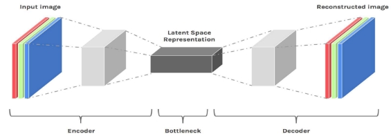

**Reverse image search:** 

Reverse image search is a content-based image retrieval query technique that involves providing the CBIR system with a sample image that it will then base its search upon; in terms of information retrieval, the sample image is what formulates a search query. 

**Approach:*** 

By observing the data its pretty clear that an Unsupervised along with couple of different Hashing approaches will be the most commendable. Although there are number of techniques in that area as well, we'll focus on Hashing and Auto-Encoder techniques: 

- ***Latent Feature Extraction***: In this technique we can find feature vectors for every image by creating hooks on a pre-trained network and extracting the vector from previous layers. Other technique devises the use of **AutoEncoders** where the Latent features can be extracted from Encoder itself. For the sake of this data we'll proceed with AutoEncoders. For the retrieval part we'll look into Euclidean based Search (O(NlogN)) and Hashing Based Approaches (O(logN)).
- ***Image Hashing Search***: This can be done by:
- Uniquely quantify the contents of an image using only a single integer.
- Find duplicate or near-duplicate images in a dataset of images based on their computed hashes.
- This can be accomplished by a specialized data structure called a vantage-point (VP) -Tree. Using a VP-Tree we can reduce our search complexity from O(nlogn) to O(log n), enabling us to obtain our sub-linear goal!

**Part 1 - AutoEncoder Model:** 

Autoencoder is an unsupervised artificial neural network that learns how to efficiently compress and encode data then learns how to reconstruct the data back **from** the reduced encoded representation **to** a representation that is as close to the original input as possible. Autoencoder, by design, reduces data dimensions by learning how to ignore the noise in the data. 

**Autoencoder Components:** Autoencoders consists of 4 main parts 

**1- Encoder**: In which the model learns how to reduce the input dimensions and compress the input data

`  `into an encoded representation**.** 

**2- Bottleneck:** which is the layer that contains the compressed representation of the input data. This is the

`  `lowest possible dimensions of the input data. 

**3- Decoder:** In which the model learns how to reconstruct the data from the encoded representation to be

`  `as close to the original input as possible.** 

**4- Reconstruction** **Loss:** This is the method that measures measure how well the decoder is performing

`  `and how close the output is to the original input. 

**Structure of an AutoEncoder:** 

**Part 2 – Finding Similar Images (Image Retrieval):** 

This will be approached with two ways as discussed in the start: 

- **Method 1: Euclidean Search:** 
- Identifying the Latent Features 
- Calculating the Euclidean Distance between them 
- Returning the closest N indexes (of images) 
- Time complexity: ~O(NlogN) 
- **Method 2: Locality Sensitive Hashing:** 
- Create hashes of the feature vector from Encoder 
- Store it in a Hashing Table 
- Identify closest images based on hamming distance 
- Time complexity: ~O(logN) 

**Flow Chart of Indexing & Searching using above methods:** 

**Output sample:** 

**Part 3 – Bonus Point (Clustering of dataset):** 

For Clustering the data into K cluster, used K-Means clustering. The **Elbow Method** is used to determine this optimal value of K. To determine the optimal number of clusters,select the value of K at the “elbow” ie the point after which the distortion/inertia start decreasing in a linear fashion. 

1. **Distortion:** It is calculated as the average of the squared distances from the cluster centers of   the respective clusters. Typically, the Euclidean distance metric is used. 
1. **Inertia:** It is the sum of squared distances of samples to their closest cluster center. 

Oriented FAST and rotated BRIEF (ORB) is particularly useful for analysis of images in light of different orientation and scale. Here The ORB technique tells us there are 6/7 major clusters that are persistent in the data 

